# SVS Custom Personality guide

## This is a guide on how to make a custom personality for Summer vacation Scramble (Samabake Scramble)

Guide made by Darksoldier27 (DS27). This is a copy of the original guide on [Google Docs](https://docs.google.com/document/d/1fD5RpCvVgpG0WixVc4MddZXAgtso_s7q_j9C-009Xuo) converted to markdown.

Feel free to submit edits to this guide in form of PRs to this repository.

# What You Need

- [SB3UGS](https://github.com/enimaroah-cubic/Sb3UGS/wiki) v25.2.5 or later  
- [Notepad++](https://notepad-plus-plus.org/downloads/)  
- [Unity 2021.3.33f1](https://unity.com/es/releases/editor/archive) **Optional**  
- An audio editor **Optional**

# Initial Preparations

Before starting, you should know that making a custom personality is a time consuming process, there are a lot of voice lines that you will have to replace, so be prepared to put a lot of time on it.

First download the template from [here](https://pixeldrain.com/u/pxiXWND9) or look for it on the SVS or Koikatsu server.
Once downloaded, uncompress it in a safe location so you can work on it.

Second, [download](https://github.com/IllusionMods/SVS_Plugins/releases) the Personality Loader plugin so the personality can actually work in game.

**Important.** If you try to put the template files inside your game, it won’t work. The template wasn’t made to be an example of a custom personality. You have to edit the files inside before your personality can work in the game.

Inside the template zip, you have all the files needed for the personality to work. You will need to edit each file inside the template.   
First you must select an ID for your personality, you can choose anything from 16\~99 and 104\~999. *~~Keep in mind that right now only IDs below 100 will appear in the Voice Settings, IDs above 100 do not appear, so for these personalities you won’t be able to change the volume.~~* **I have fixed the issue with the ID above 100, so pick any ID that you want. Now they will appear in the Voice Settings.**

**Also let me know which IDs are you planning to use, since duplicated IDs are not supported. Currently I have a spreadsheet to keep track of the progress on [Custom Personalities](SVS%20Custom%20Personalities.xlsx) ([Original on Google Docs](https://docs.google.com/spreadsheets/d/1jub1UsWOEzQadxF0pumAdjYqFObiHgmp4kU-ezn2lgc/edit?usp=sharing)).**

**I have made a spreadsheet if you want to keep track on which file you have replaced [SVS Personality Voice](SVS%20Personality%20Voice%20Files%20Template.xlsx) ([Original on Google Docs](https://docs.google.com/spreadsheets/u/0/d/1oGlXUsWOMP7cZmuSpcUjsXz2JRtfHM1o4ZptGNp0dG4/edit)).**

# Action Folder

I don’t know what this is used for yet. For now you don’t have to worry about it. And I forgot to include it in the template anyway.

# ADV Folder {#adv-folder}

Inside the **ADV** folder we find the scenario folder, inside this folder there is another folder named “**c with numbers”** or  in this case **“c200”,** the numbers represent the ID of the personality, so whenever you find a folder that looks like “c200”, you will have to change the number to the ID of the personality you are gonna make. For this guide, I’m gonna call all the folders that start with c **“c folders”** so you will know that you will have to change the numbers after the “c” with the ID of your personality.

***Here is an example*****:** *If I pick ID 83 for my personality, all **c folders** inside the template must be renamed **c083.***

Make sure that you do not name the **c folder** with an ID that is already in use (like an ID from the vanilla personalities).

Now if we go inside the **c folder** you will find another folder named with just numbers, for this one doesn’t matter the name of the folder, so you can keep it as it is.

And finally inside we find the scenario files, these are the ones that tell the game which text will appear and voice that will play during the ADV Scene.

*This is a scenario in the game.*  
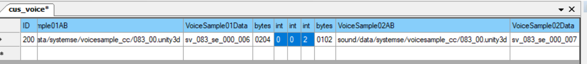

## Creating scenario for the Personality  {#creating-scenario-for-the-personality}

The scenarios are stored in these files, each one has different types of scenario, some don’t have text to display:

- **00.unity3d** \<- Contain all text for Normal Interactions.  
- **01.unity3d** \<- Contain the text for Interruptions..  
- **02.unity3d** \<- Contain the path for the voice lines during NPC to NPC Interactions.  
- **03.unity3d** \<- Contain the path for voice lines for NPCs, but I don’t know for which situation.  
- **04.unity3d** \<- Contain all the text for the H Scenes.

These files also contain the path to the voice files.

We can open these files with SB3UGS, inside we can find a bunch of MonoBehaviours.   
*The picture shows the content of file 00.unity3d*  
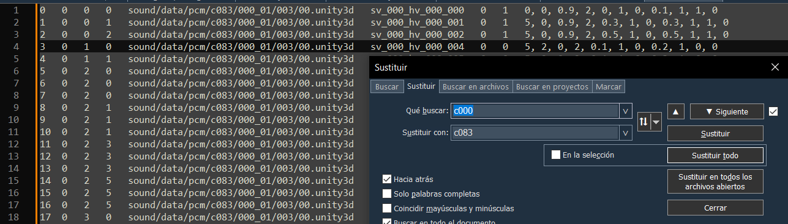

We can open each MonoBehaviour (MB) with a double click. By doing that it will open the content of the MB into the **Editor Tab.**  
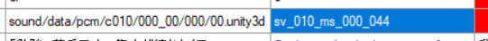

Here we can see a bunch of stuff, but the only important thing for us is the **File Path**, **Audio Clip**, and the **Text** for dialogues.

First thing we need to do here is to set the file path for our [**audio file**](#sound-folder). If you notice, there is a **c folder** in the file path, remember to rename that folder with the [**ID of your personality**](#adv-folder). Or you can set your own file path, but I don’t recommend doing this so it is better to keep everything as it is.

*The highlighted part is the file path:*  
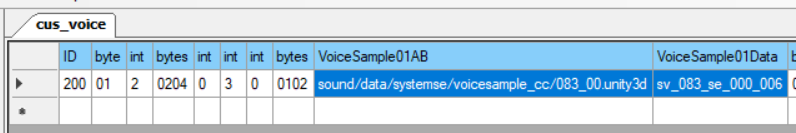

Next to the file path, we have the **Audio Clip** name.  
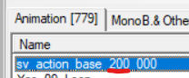

SVS use the following format for the **Audio Clip** names:

- \*\*\_ \<- Game  
- sv\_\*\*\* \<- Personality ID  
- sv\_010\_\*\* \<- Type  
- sv\_010\_ms\_\*\*\*\_\*\*\* \<- numbers

When you make your [**audio files**](#sound-folder), you can keep this name format for your Audio Clips or use your own. For simplicity sake, we are gonna use the SVS name format.

So the only thing we need to do is to replace the ID in the **Audio Clip** name with the ID of the personality we are gonna use.  
For example if the personality id is **83**.  
Then we name our **Audio Clips** like this: sv\_**083**\_ms\_000\_044

*Note: If your personality ends up without sound when testing. Check that the file path or the audio clip names are correct, and they are referencing the right audio file and audio clip.*

Below the file path and the audio clip. We have the text for the dialogues.   
*From left to right: JP text, English text and the last 2 are chineses:*  
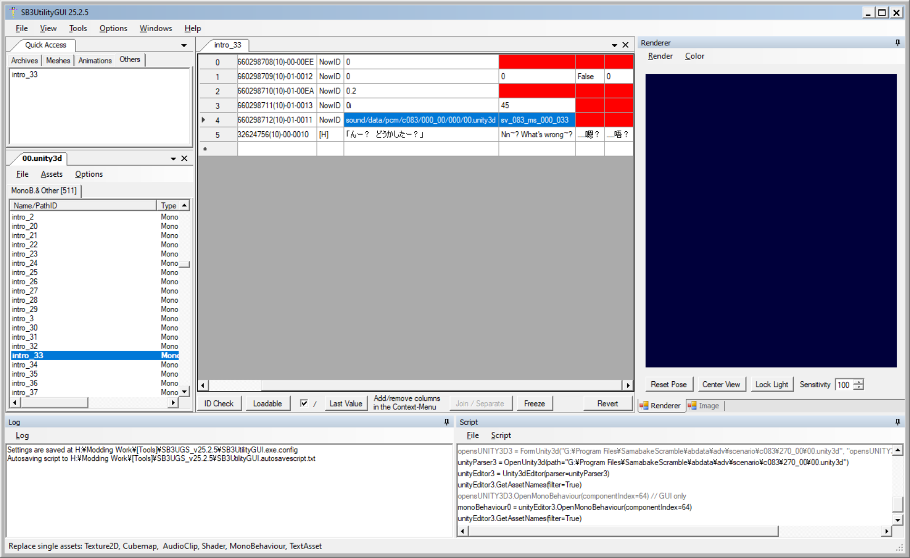

Here select the text that you want to change so it can match the voice line of your custom personality.

Now you will have to do the same for every MB in every scenario file.  
For files: **00.unity3d, 01.unity3d** and **04.unity3d** you have to set the audio path and text.  
For files **02.unity3d** and **03.unity3d** you only need to set the path for the audio file. Since it doesn’t have text.

# Custom Folder

On the custom folder we have the list of the voice samples for the chara maker.   
On the template, the file is named **200.unity3d**, you have to change the name of this file to the ID of your personality or any unique number. If you are working on multiple personalities, you will want to have all the sample voices listed on this file.

You can edit the list file with SB3UGS.   
Once you open the file, double click on the **cus\_voice** TextAsset so the list can be shown in the editor tab.  
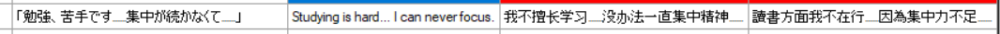  
Double click on the cus\_voice TextAsset so the list can be shown.

## Setting voice sample for chara maker {#setting-voice-sample-for-chara-maker}

### ID

On the ID field, you put the ID of your personality  
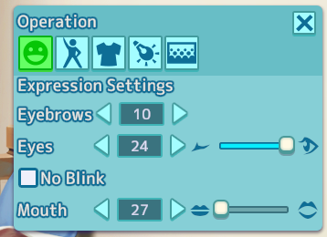  
 

### Face Expression

These 3 fields are for the type of expression the character will do when the voice sample plays   
*From left to right: Eyebrows, Eyes, Mouth.*  
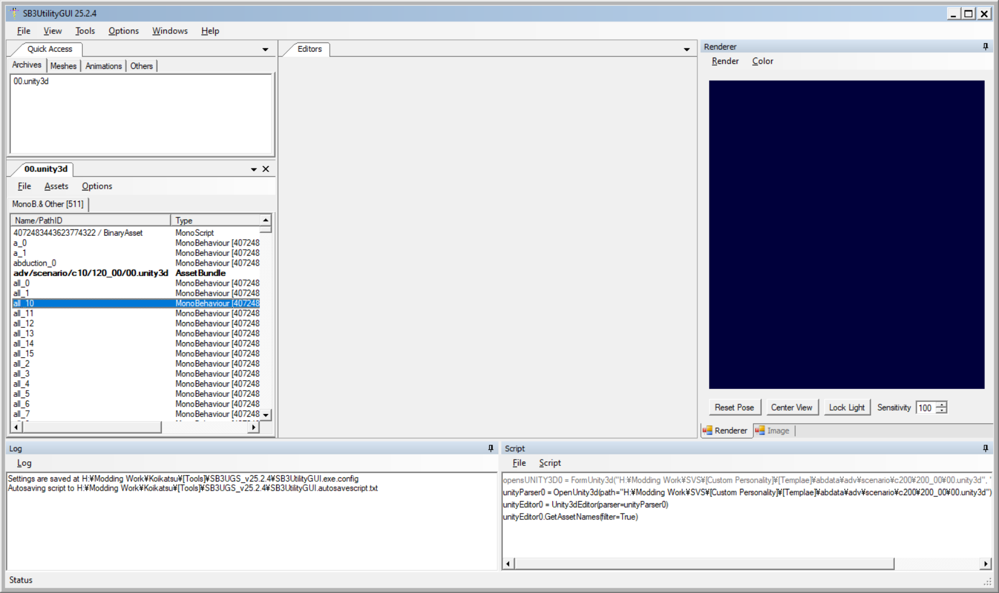

On the chara maker will look like this:  
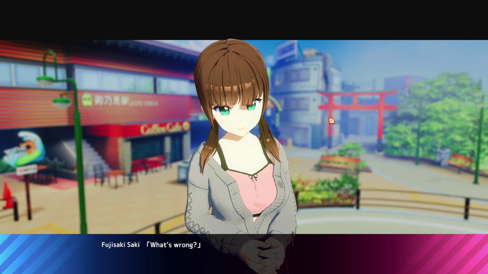  
So that’s how you set the face expression when the sample voice plays for your personality.

***NOTE: Don't use values higher than these.***   
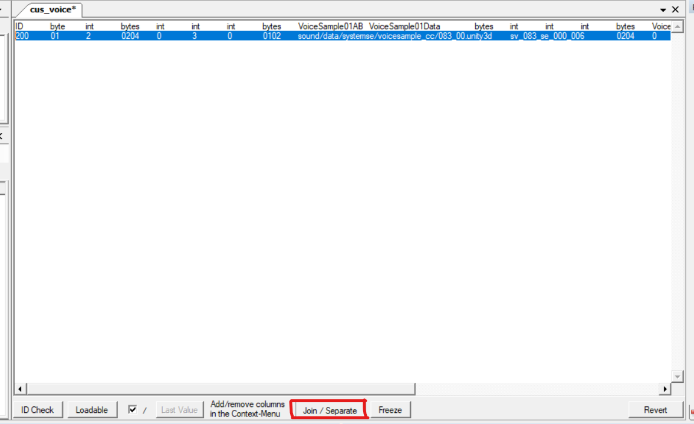

### Voice sample file path and asset

Lastly we have the file path of the voice sample and the audio clip name.  
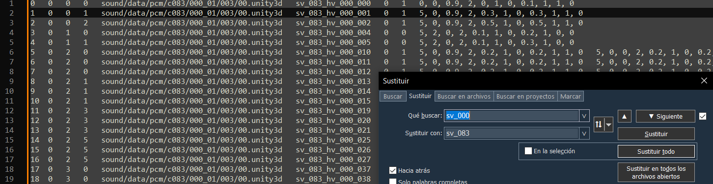  
Make sure the path is referencing the unity3d file that contains the voice samples of your personality, otherwise the voice won’t play in chara maker.

If you scroll a little bit, you will notice this:  
A second voice sample listed, the process is the same as the first one.  
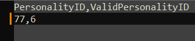

These 3 fields are for the expression for the second voice sample, and to the right we have the file path for the second voice sample.  
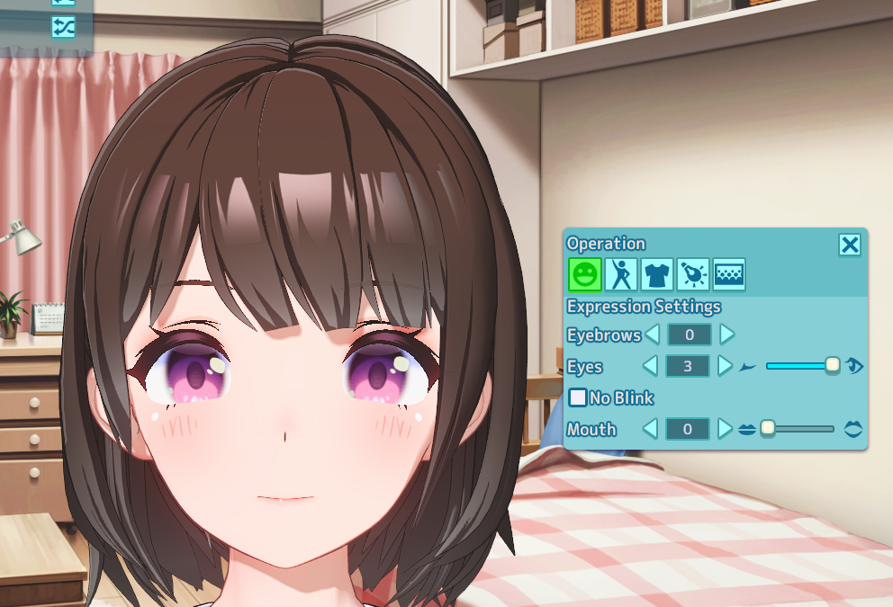

After that you are pretty much done. Save and close the unity3d file.

### Adding voice samples for multiple Personalities

If you are working on more than 1 personality, you can add another line to this list instead of making a new unity3d file.

To add another line just press the Join / Separate button in SB3UGS, then copy and paste the first line right below it.  
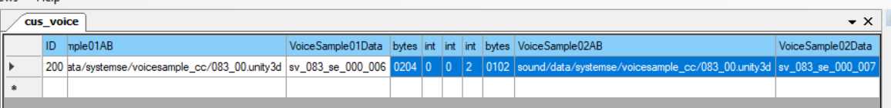  
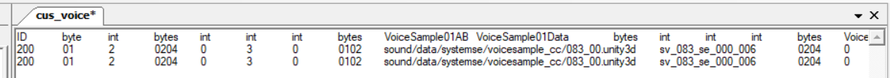

Once you are done adding to the list, click the **Join / Separate** button again so it will go back to how it was before.

Now you just have to repeat the process for the new list, Set the ID, Expression and file path for both voice samples.  
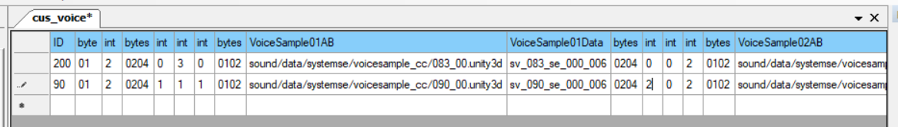

And that’s all for this file. 

# Etcetra Folder

This folder is the most important, because it has the file that enables the Personality in the game.

Go inside until you find a folder with just numbers (etcetra\\list\\**200\_00**), I’m gonna call this folder the **Personality Folder,** since it is the one that contains the files for the personality to load. On the template this folder is named **200\_00**

We have to rename the **Personality Folder** so it has a unique number. You can choose any number below 1000, and do **not** use the same numbers as the vanilla folder.

For example, you can name the folder like this ***090\_00***  
Once you are done with that, we can set our personality.

## Set the Personality  {#set-the-personality}

Inside the **Personality Folder** we find 3 files:

- **animator.csv**  
- **config.unity3d**  
- **exp.unity3d**

I will explain the **animator.csv** file later. Right now we are gonna open the **config.unity3d** with SB3UGS.  
Once open, we are gonna double click on the **MonoBehaviour** so you can see the personality array.  
*Note: I don’t know if the **MonoBehaviour** needs an unique name, but just to be safe, rename it with an unique number below 999\.*  
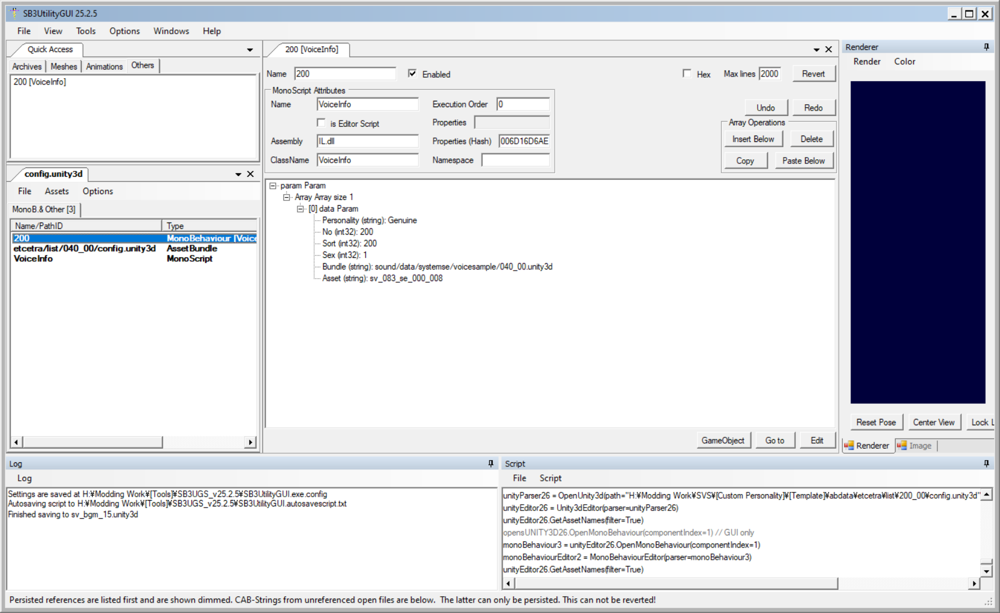  
The MB content will appear and the Editor tab.  
Here is where we can set the personality Name, ID, Sort, Sex, the file path of the voice sample used in the voice setting, and the voice clip name.

**NOTE: IDs above 100 won’t appear in the Voice Setting, they will still work on everything else, but you won’t be able to change the volume, at least for now.**

For our custom personality we are gonna fill each field.

**Personality** (string): \[The name of your personality\]  
**No** (int): \[Personality ID, must be a number non negative\]  
**Sort** (int): \[Same as the ID\]  
**Sex** (int): \[Her you can only put a **0** or **1**,  **0 \= Male**, **1 \= Female**\]  
**Bundle** (string): \[File path of the voice sample\]  
**Asset** (string): \[Voice clip name\]

***Note: don’t use IDs 0 to 15 and 100 to 103\. Those are used for the vanilla personalities.***

If you are working on another personality, here is where you set it as well.  
To add another personality param, select the **data Param**, click the **Copy** button and then press **Paste Below.**  
Then it just matters to set the params for the other personality.

For example: This is how it looks for vanilla personalities.  
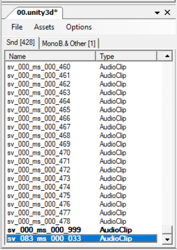

Once you are done, now the personality can appear in the chara maker and it will work in-game.

## Exp.unity3d

I think this file has something to do with expression or something.  
The only thing we need to do here is to make sure the MonoBehaviour inside has as a name the ID of your personality.  
For example if we use ID 83, we name the MonoBehaviour c083 \<- if you notice this is the same name as the [**c folders.**](#adv-folder)  
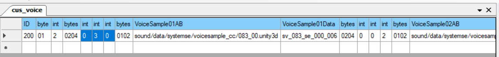

If you are working on multiple personalities you will need to add another MonoBehaviour, this can be done with SB3UGS with the **Mark/Unmark for copying** option. Essentially you will have to copy the MB from another **exp.unity3d.**

## Animator.csv

This file is only used by the Personality Loader plugin.   
It will make your custom personality load the animations from one of the [vanilla personalities.](https://wiki.anime-sharing.com/hgames/index.php?title=Summer_Vacation!_Scramble/Character_Creation/Personalities)

If this file is not set up properly, the character will appear in T-Pose whenever you interact with them and it can cause a **Softlock** during interactions.

To set this file is pretty easy. You can open it with any text editor like notepad, notepad++, etc..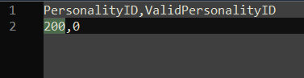  
Once open, you will find two lines, ignore the first line, we only need to set up the second line.

The First value before the **“ , “** is for your custom personality ID.  
The Second value after the **“ , ”** is for one of the vanilla personalities.

For example, my custom personality is using ID 77 and I want to use the animations of the Personality 6 (Pure).  
I will have to put the values like this:  
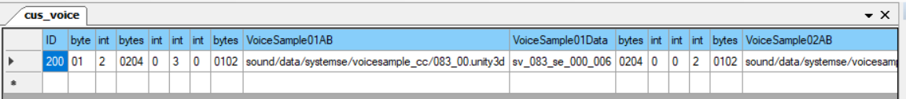

If you are working on multiple personalities, you can add more lines below.  
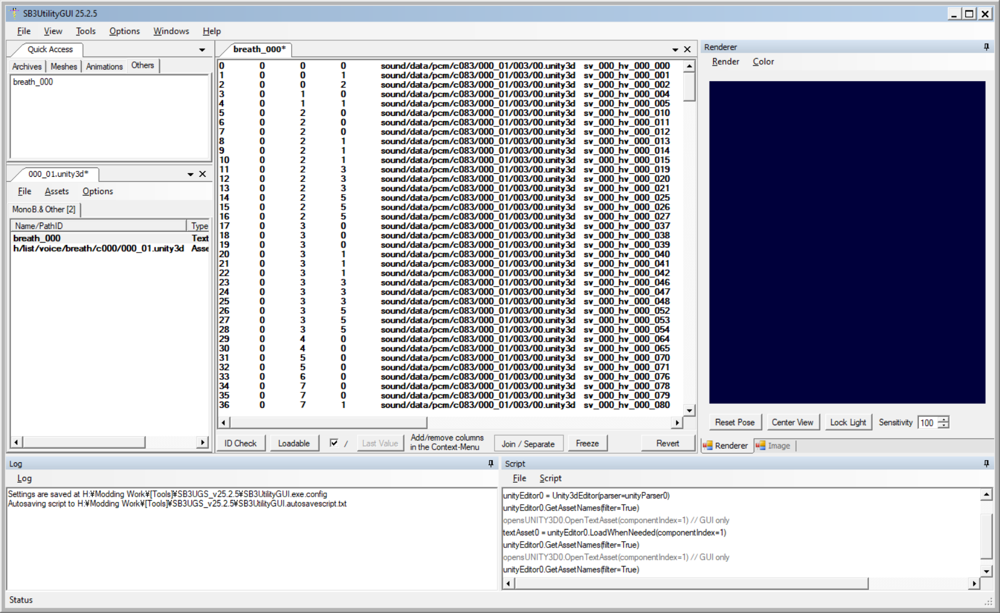

After you are done, save and close the animator.csv file.

*Here is a list with the IDs of the vanilla personalities.*  
IDs Females:

* **0**: Ordinary / Girl Next Door  
* **1**: Cheeky / Rascal  
* **2**: Cool / Enigma  
* **3**: Gyaru / Airhead  
* **4**: Hesitant (Brave) / Good Girl  
* **5**: Bewitching / Enchantress  
* **6**: Innocent (Pure) / Pure Heart  
* **7**: Motherly / Mother Figure  
* **8**: Devilish / Little Devil  
* **9**: Yankee / Rebel  
* **10**: Reserved / Introvert  
* **11**: Ojousama / Heiress  
* **12**: Relaxed / Slacker  
* **13**: Otaku / Geek  
* **14**: Mischievous / Narcissist  
* **15**: Energetic / Dynamo

IDs Males:

* **100**: Agreeable/Nice Guy  
* **101**: Bold/Hotshot  
* **102**: Nonchalant/Innocent  
* **103:** Naive/Vagabond

# GameData Folder

The gamedata folder has all the animations for our personality. Currently these animations are only used for the overworld.

If you navigate inside, you will find 2 folders under the motion folder.  
These are Female and Male folders.

The Female folder contains the animations for Female Personalities, while the Male one contains the animations for Male personalities.

Depending on the type of the personality you are gonna work with, you can either delete the folder of the type you are not working on, or keep both if you are working on both types of personalities. 

Inside of both folders, there is a unity3d file.   
This file also needs to have a unique number as a name, you can use the ID of your personality or any number below 999\_99.

Name Examples:

- female/**200\_00**.unity3d \<- this is what the template uses.  
- female/**090\_11**.unity3d  
- male/**033\_44**.unity3d

Once you have renamed the file, open it with SB3UGS.  
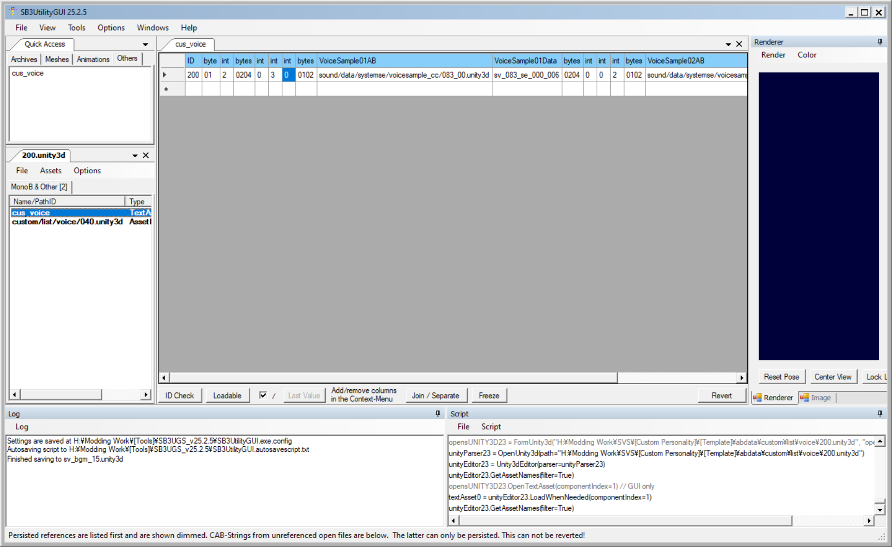

Now we need to change the name of the animatorController, we only need to change this part of the name:  
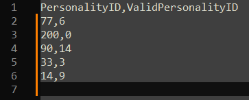  
Replace that number with the ID of your personality.  
Example: **sv\_action\_base\_083\_000** if we are using ID 83\.

Once that is done, save and close the unity file.

***If the game softlock when you try to play with your custom personality (Like when you go to talk to them or they interact with you), is either this file is missing or the animator controller name is wrong.***

# H Folder {#h-folder}

The H folder contains the list for all voices that play during the H scenes. 

Open the folder until you find these 3 folders: 

- **breath**  
- **general**  
- **heart**

Inside of each folder you will find a **c folder**,  you should know by now. We rename these **c folder** so it has the ID of your personality.

For example you personality uses ID 90, this is how it should look like:

- breath\\**c090**  
- general\\**c090**  
- heart\\**c090**

Inside each **c folder** you will find a **unity3d** file, this time we don’t need to rename the **unity3d** file.

Now we are gonna open one of the files with SB3UGS. Our objective this time is just to change the file path and **Audio clip** name.

Once you have opened the file, double click on the **TextAsset** so the list can appear on the editor tab.  
*The picture shows the content of the unity3d file that is inside the breath folder.*  
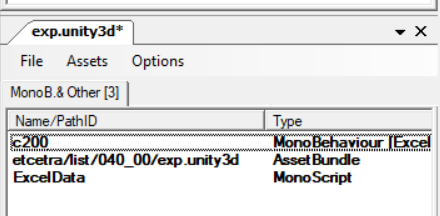

Once the list is visible, we need to change the **file path** and **Audio Clip** name on each line. Instead of manually changing each line, we can do it in an easier and faster way. 

For this we only need to grab the whole list as a text, we can do this by pressing the **Join / Separate** button on SB3UGS and then we copy all the lines.  
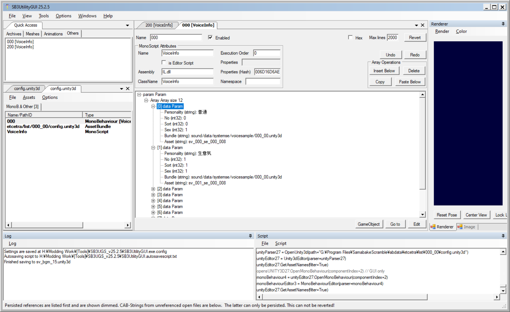

After that we paste it into Notepad++ or whatever text editor you have. 

Now we have to do a **Search and Replace**.

Search for c000 and replace it with **c\[ID of your personality\]** on your text editor.  
*In the picture, I’m using notepad++.*  
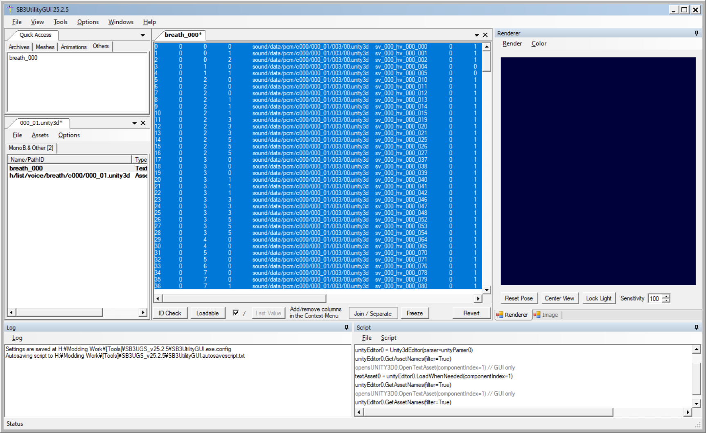

Then hit **Replace All** Button on your text editor.  
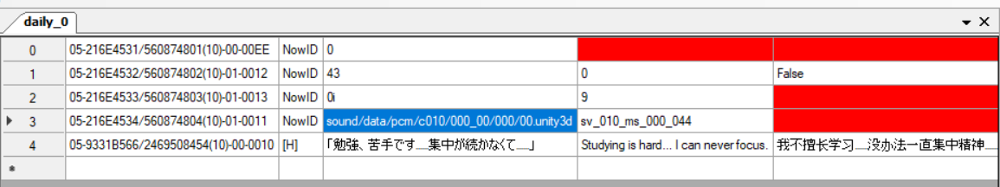

Now we have to do the same for the **Audio Clip.**

Search for **sv\_000** and replace it with sv\_\[ID of your personality\] and we do the same process.  
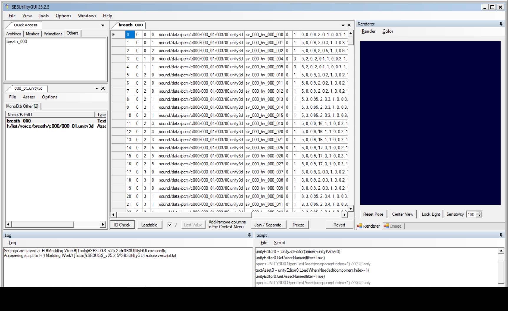  
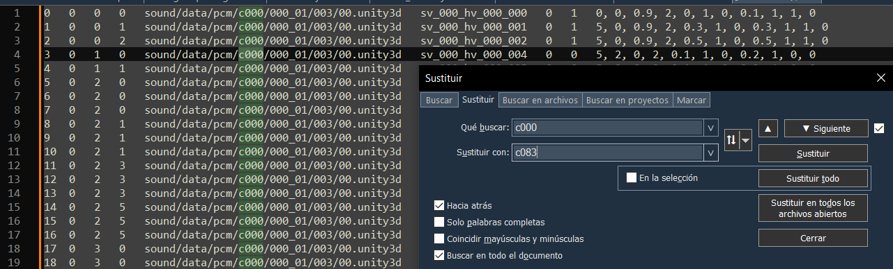

Once we are finish replacing the **file path** and **Audio Clip**, we can copy all the text and paste it back to SB3UGS  
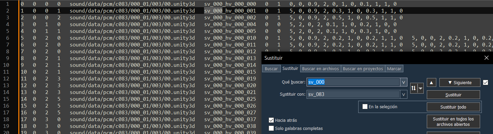  
Now just save and close the unity file.

Repeat the same process with the other 2 files.  
If the file paths are not correct, the H scene will not work with a custom personality.

# Sound Folder {#sound-folder}

The sound folder contains all the voice files we need for the personality.

Inside we can find a couple of folders.  
First we have:

- sound\\data\\pcm  
- sound\\data\\systemse 

Inside **pcm** we have 4 folders and one of these folders is a [**c folder**](#adv-folder). Each folder contains a unity3d file inside that has the following:

- **brandcall** \<- contains the voice that plays when you start the game.  
- **homevoice** \<- contains the voice when you add or remove a character in the character roster screen.  
- **titlecall** \<- contains the voice when you are in the title screen.  
- **c folder** \<- contain all the voices for the personality and H Scenes. \[remember to rename this folder with the ID of your personality\]

The name of the unity3d files need to be unique and only have numbers in the name.  
For this guide I will suggest using anything from 200\_00 to 999\_99 if you need to name them.   
(Except for the unity3d files inside the **c folder**, **those should not be renamed**, *I mean you can, but there is not point on doing it*) 

*Note: I think you can still add a name after the numbers, I tried with the name of “200\_00\_**custom**.unity3d” for the **homevoice** unity3d file, and the game still read the file inside.*

Now let’s check the **systemse** folder, here we find 2 folders:

- **voicesample** \<- contain the sample voice for the Voice Setting. \[This file need to be referenced when you [set the personality](#set-the-personality)\]  
- **voicesample\_cc** \<- contains the sample voices for chara maker. \[This file need to be referenced when [setting the voice sample](#setting-voice-sample-for-chara-maker)\]

We can open all the .unity3d files inside these folders with SB3U, but before starting, I need to explain that there are 2 ways of doing this.  
Our objective is to replace all the audio files inside the template with the audio files of our personality.   
And we have 2 way of doing it:

- 1: We can replace each **Audio Clip** with SB3UGS.  
- 2: We can make our own Asset Bundle that will contain the **Audio Clips**.

For both cases we still need to use the SVS name format, if you forgot here is again:  
*SVS use the following format for the **Audio Clip** names:*

- *\*\*\_ \<- Game*  
- *sv\_\*\*\* \<- Personality ID*  
- *sv\_010\_\*\* \<- Type*  
- *sv\_010\_ms\_\*\*\*\_\*\*\* \<- numbers*

Whenever you replace the **Voice Clip** with your own or make a new Asset Bundle, make sure to keep the same name format for the **Audio Clips**.

## Replacing the Audio with SB3UGS

In order to replace the audio using SB3UGS, we need first to rename our Audio File so it has the same name of the audio clip we want to replace.

For example, If I want to replace audio **sv\_000\_ms\_000\_033**, I have to rename my Audio file to **sv\_000\_ms\_000\_033**.  
Or you can do it the other way around. As long as both audio files have the same name, it will work.  
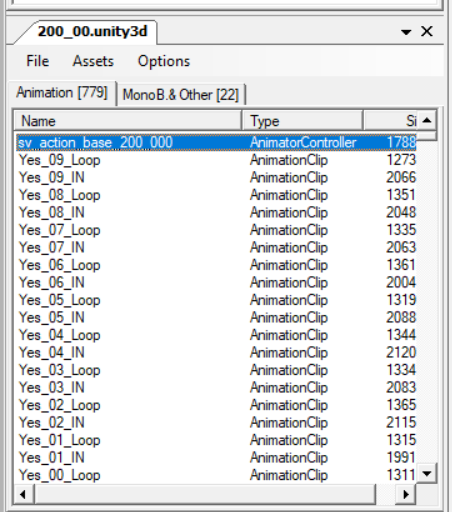  
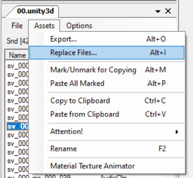

After you have successfully replaced the audio, you only have to rename your **Audio Clip.**  
Remember that the **Audio Clip** name is referenced on the [scenario file](#creating-scenario-for-the-personality).  
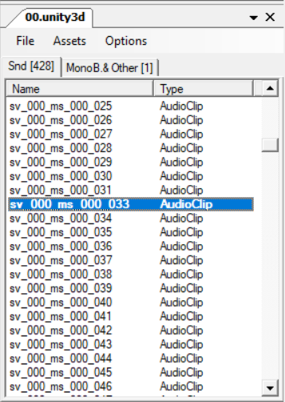  
Now you have to do the same for every audio clip.

**REALLY IMPORTANT:**  
Make sure the path of each scenario is referencing the correct path to the voice file.

For example, I changed this scenario for my custom personality  
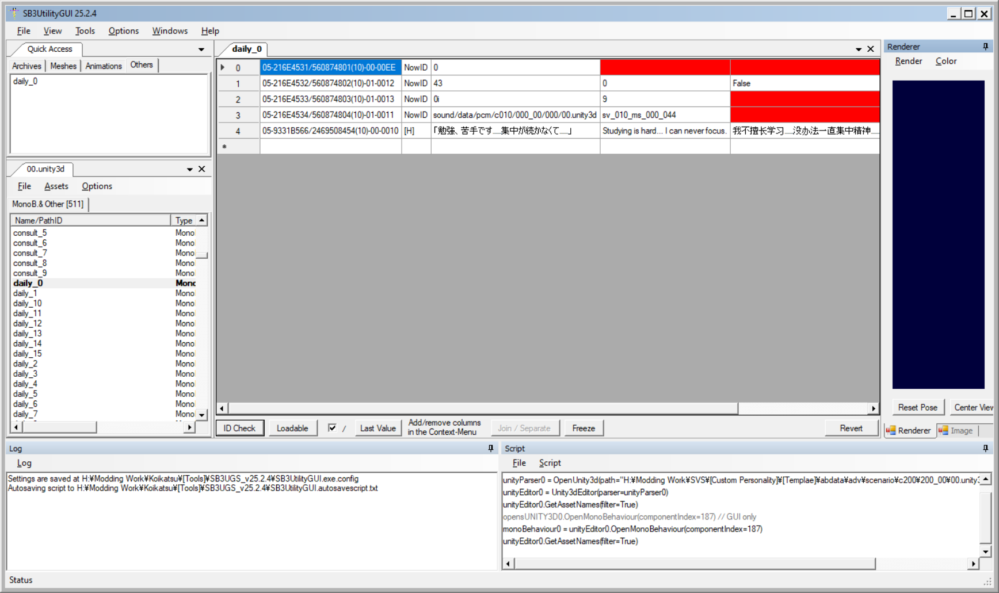  
Now you can see that the path and the audio clip name match to where the voice file is located and is loading the correct audio clip.

*NOTE: Some audio clips are not listed in the [ADV folder](#adv-folder). Instead you can find them listed in the [H folder](#h-folder), since those audio clips are used during the H scene and do not have any text.*

## How to make asset bundles with Unity

WIP.

# Installing your custom personality

Once you are done editing all the files, just grab the **abdata** folder and put it where the game is installed, it should not rewrite any vanilla files, if you get asked to replace a vanilla file, you forgot to rename a file.

# End

And that’s pretty much it, I will be more than happy to help if you get stuck in any step.  
For questions and stuff, you can find me on the SVS Discord server or on the Koikatsu Discord server.  
(or anywhere else really)

Special thanks to Enimaroah for updating SB3UGS to be compatible with SVS listing files, and making it  so we can edit the scenarios files.
